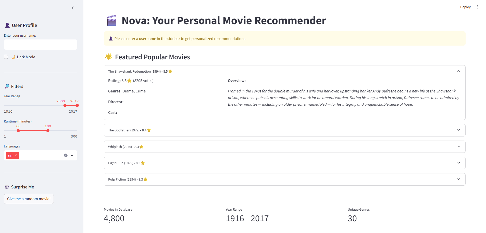
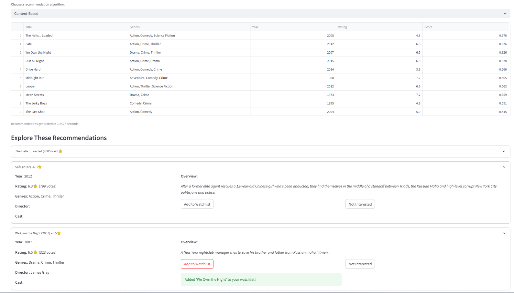
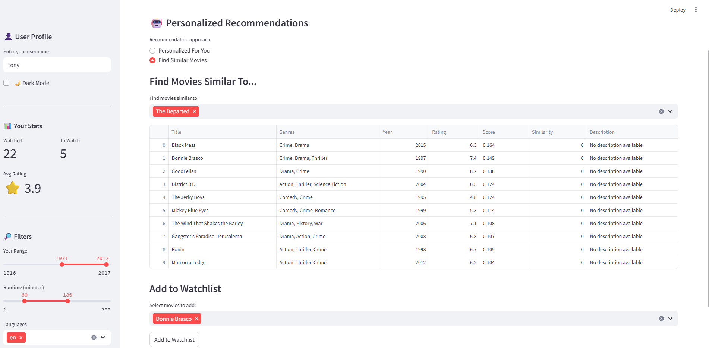
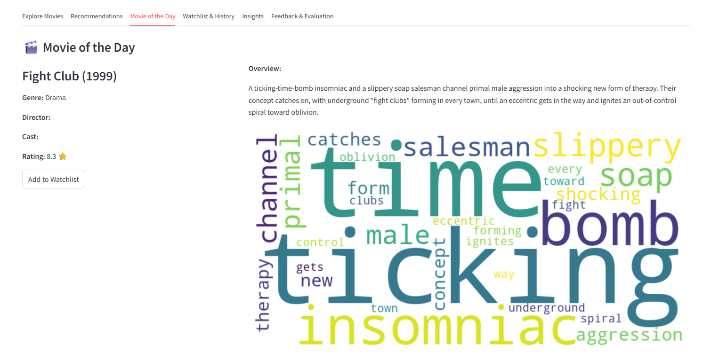
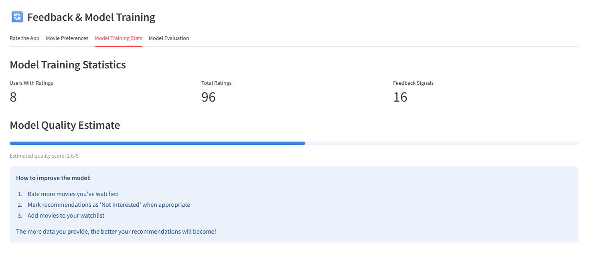
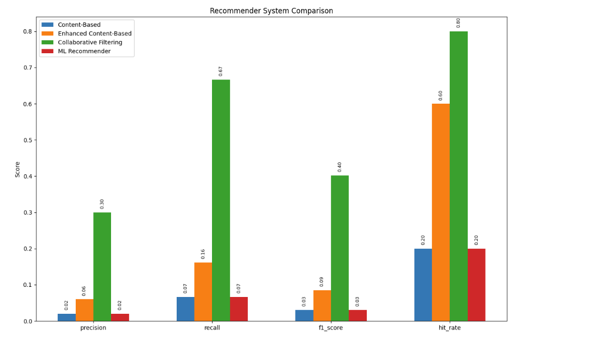

# Nova Movie Recommendation System

Nova is a comprehensive movie recommendation system built with Streamlit that offers personalized movie recommendations using various machine learning algorithms.

## Features

- **Personalized Recommendations**: Content-based, collaborative, and hybrid recommendation models
- **Movie Exploration**: Search and browse the TMDB 5000 movie database
- **User Profiles**: Save your favorite genres and movies
- **Watchlist Management**: Track movies you want to watch and have watched
- **Analytics & Insights**: Visualize movie data and your viewing preferences
- **Daily Movie Recommendations**: Get a new movie suggestion every day


## Demo Gallery

A quick look at Nova’s Streamlit UI and key features:

| Front Page                 | Recommendations            |
|:---------------------------|:---------------------------|
|            |        |

| Similar Movies             | Movie of the Day           |
|:---------------------------|:---------------------------|
|    |        |

| Model Insights             | Evaluation                 |
|:---------------------------|:---------------------------|
|    |                |


## Installation

### Prerequisites

- Python 3.7+
- pip (Python package installer)

### Setup

1. Clone the repository:
   ```
   git clone https://github.com/tonykorycki/NYU-DS-Bootcamp-Nova-movie-recommendation-project
   cd NYU-DS-Bootcamp-Nova-movie-recommendation-project
   ```

2. Create and activate a virtual environment (recommended):
   ```
   python -m venv venv
   
   # On Windows:
   venv\Scripts\activate
   
   # On macOS/Linux:
   source venv/bin/activate
   ```

3. Install dependencies:
   ```
   pip install -r requirements.txt
   ```

## Running the Application

You can run Nova using either of two main scripts:

### Option 1: Using app4.py (Classic Interface)

This is a more lightweight, classic Streamlit interface:

```
streamlit run app4.py
```

### Option 2: Using main.py (Feature-Rich Interface)

This is the fully featured version with all recommendation algorithms and UI enhancements:

```
streamlit run main.py
```

## Dataset

Nova requires the TMDB 5000 movies dataset. You should have the following CSV files in your project directory:
- tmdb_5000_movies.csv
- tmdb_5000_credits.csv

If you don't have these files, you can download them from [Kaggle](https://www.kaggle.com/tmdb/tmdb-movie-metadata).

## First-Time Use

1. Enter a username in the sidebar to enable personalized features
2. Select your favorite genres and movies you like
3. Explore recommendations or search for specific movies
4. Add movies to your watchlist
5. Rate movies you've watched to improve recommendations

## Recommendation Models: Training, Usage & Evaluation

Nova includes several recommendation models, each with different strengths. Here's how to use and evaluate them:

### Available Models

#### 1. ML Recommender (Best)
- **Approach**: Hybrid model that combines content features with user ratings and feedback
- **Strengths**: Balances content similarity with collaborative patterns; adapts to user feedback
- **Best for**: Most users, especially those with at least 5 rated movies

#### 2. Content-Based Recommender
- **Approach**: Recommends movies similar to what you've watched based on features like genre, plot, actors
- **Strengths**: Works well even for new users; doesn't require data from other users
- **Best for**: New users or those with unique taste profiles

#### 3. Collaborative Filtering
- **Approach**: Finds users similar to you and recommends what they liked
- **Strengths**: Discovers unexpected recommendations that content analysis might miss
- **Best for**: Users with sufficient rating history and common preferences

#### 4. Matrix Factorization
- **Approach**: Decomposes the user-movie matrix to find latent factors
- **Strengths**: Often more accurate than basic collaborative filtering; handles sparse data well
- **Best for**: Large datasets with many users and ratings

#### 5. Popular Movies Recommender
- **Approach**: Recommends widely popular, highly-rated movies weighted by recency
- **Strengths**: Reliable, crowd-pleasing recommendations; requires no user history
- **Best for**: New users or when you want mainstream hits

#### 6. Hybrid Recommendations
- **Approach**: Combines multiple recommenders (currently content + collaborative)
- **Strengths**: Balances the strengths of different approaches
- **Best for**: Getting diverse, well-rounded recommendations

### Training the Models

All models in Nova train automatically when needed, but you can also trigger training:

1. **Automatic Training**: Models train automatically when:
   - A new user provides their first few ratings
   - An existing user adds significant new ratings
   - The application is started and no model files exist

2. **Manual Model Training**:
   - Run `python train_models.py` to train all models on existing user data
   - Or use the "Run Evaluation" button in the Model Evaluation tab to trigger both training and testing

3. **Training Data Requirements**:
   - ML Recommender: Requires user ratings (at least 5 users with ratings for optimal performance)
   - Collaborative Filtering: Requires multiple users with ratings
   - Content-Based: No user data required, trains on movie features
   - Matrix Factorization: Requires user ratings from multiple users
   - Popular Movies: No training required

### Using Different Models

1. Log in with your username in the sidebar
2. Go to the Recommendations tab
3. Select "Personalized For You" approach
4. Choose a recommendation algorithm from the dropdown
5. The system will generate recommendations based on your watched movies and ratings

### Evaluating Model Performance

Nova includes a comprehensive evaluation framework:

1. **Run the Evaluator**:
   - Go to Feedback & Evaluation tab → Model Evaluation
   - Click "Run Evaluation"

2. **Evaluation Process**:
   - The system splits existing user ratings into training and test sets
   - Each model is trained on training data and generates recommendations
   - These recommendations are compared against the test set
   - Multiple metrics are calculated to assess performance

3. **Evaluation Metrics**:
   - **Precision**: What percentage of recommendations were relevant to the user
   - **Recall**: What percentage of relevant items were successfully recommended
   - **F1 Score**: Harmonic mean of precision and recall
   - **Hit Rate**: Percentage of users who received at least one relevant recommendation
   - **Coverage**: Diversity of items the system can recommend
   - **Diversity**: Average variety in recommendations (e.g., genre diversity)
   - **Runtime**: Time required to generate recommendations

4. **Interpreting Results**:
   - No single model is best for all situations
   - ML Recommender often has best overall F1 score
   - Content-based has better cold-start performance
   - Collaborative has better serendipity (unexpected good recommendations)

5. **Manual Evaluation**:
   - You can also evaluate models subjectively by trying different ones
   - Use the "Not Interested" button to help train the ML model on your preferences

## Project Structure

- app4.py: Classic interface application file
- main.py: Feature-rich main application file
- data_loader.py: Functions for loading and processing movie data
- utils.py: Utility functions for the application
- recommenders: Directory containing different recommendation algorithms
  - base.py: Base recommender class and utility functions
  - content_based.py: Content-based recommendation algorithms
  - collaborative.py: Collaborative filtering algorithms
  - matrix_factorization.py: Matrix factorization recommender
  - ml_recommender.py: Hybrid ML-based recommender
  - popular.py: Popular movie recommender
- models: Trained model files (created automatically)
- profiles: User profiles (created automatically)
- watchlists: User watchlists (created automatically)
- feedback: User feedback and ratings (created automatically)
- evaluation: Model evaluation results (created automatically)
